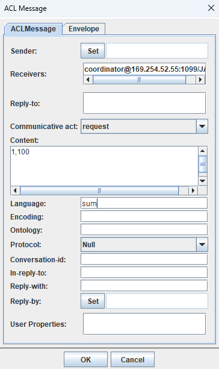
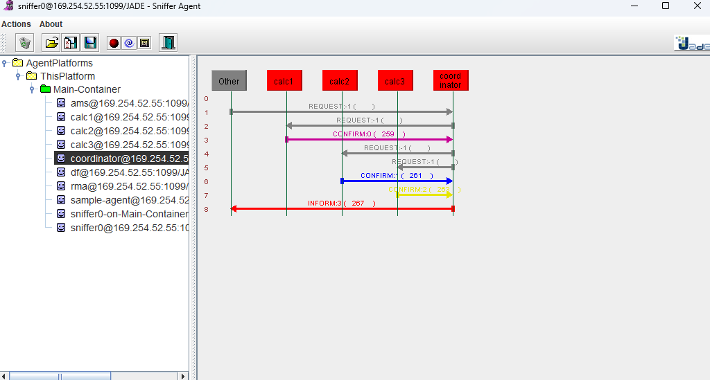
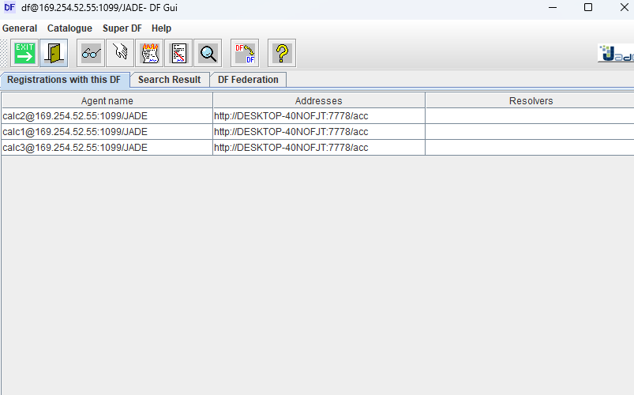
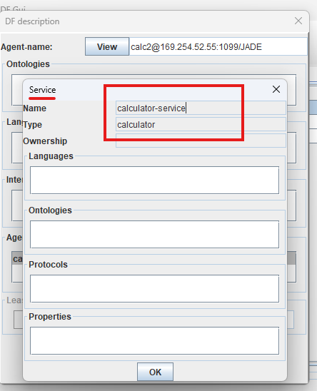
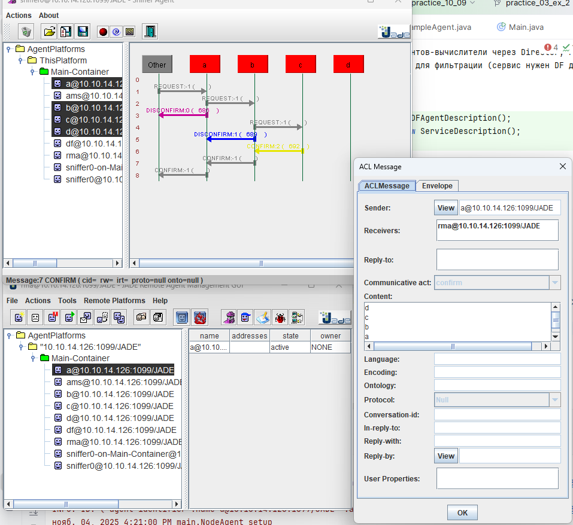

### Задача 1 (ветка main)


### Практика 3, задача 1б (ветка practice_03)

    1. Вместо передачи имён через аргумент, координатор получает имена вычислителей через DF.
    2. Координатор будет периодически обновлять список имён.

Координатор автоматически ищет агентов-вычислители через Directory Facilitator (DF).
Публикуем тип сервиса "calculator" для фильтрации (сервис нужен DF для взаимодействия с нашим сервисом вычислений).


```java
DFAgentDescription template = new DFAgentDescription();
ServiceDescription sdTemplate = new ServiceDescription();
sdTemplate.setType("calculator");
template.addServices(sdTemplate);
```





### Задача 2 (ветка practice_03_ex_2)

1) При получении REQUEST узел ищет целевую вершину у себя, в списке соседей, если нашел - отвечает отправителю,
   если нет - отсылает новое сообщение ВСЕМ соседям;
2) Если узел нашел у себя в соседях искомую вершину, он отправляет CONFIRM обратно по цепочке с накоплением контента в виде имен узлов.




### Задача 1в (ветка practice_04_ex_1_v)

### Условия и выполнение

1. **Логика координатора оформлена как машина из двух состояний**
    - Состояния: `ожидание запроса`, `выполнение вычисления`.
    - Реализовано через флаг `isProcessing`.
    - Во время выполнения новые запросы отклоняются с `REFUSE`.

2. **Логика вычислителя оформлена как машина из двух состояний**
    - Состояния: `свободен`, `занят`.
    - Реализовано через флаг `isBusy`.
    - Во время вычисления новые запросы отклоняются с `REFUSE`.

3. **Оба агента отвечают `REFUSE` при занятости**
    - Координатор: отклоняет, если `isProcessing == true`.
    - Вычислитель: отклоняет, если `isBusy == true`.
    - Отказ отправляется сразу, без задержки.

4. **Поведение продемонстрировано**
    - В логах видно: 
        - Клиенты получают `REFUSE` и выводят:  
          `🚫 Запрос отклонён: Coordinator is busy`  
          `🚫 Запрос отклонён: Calculator is busy`

5. **Система не обрабатывает несколько запросов одновременно**
    - Нет параллельных вычислений.
    - Новые запросы не накапливаются и не теряются — отклоняются.

## Вывод
Все условия выполнены:
- Машины состояний реализованы.
- Отказ при занятости работает.
- Поведение подтверждено в логах.
     


