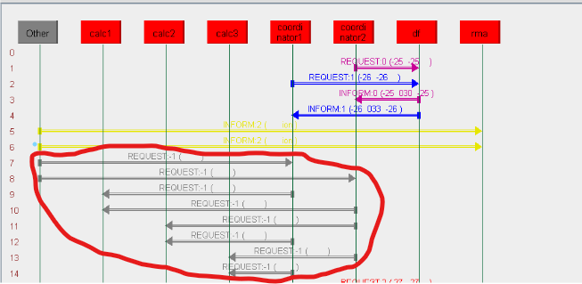
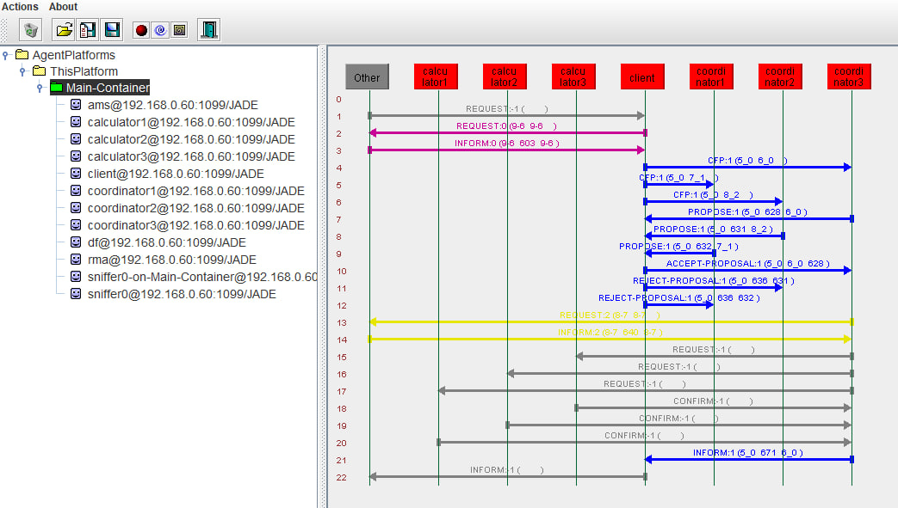
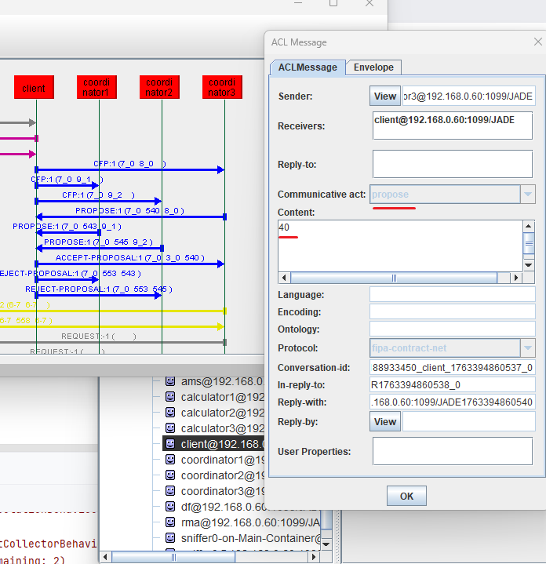
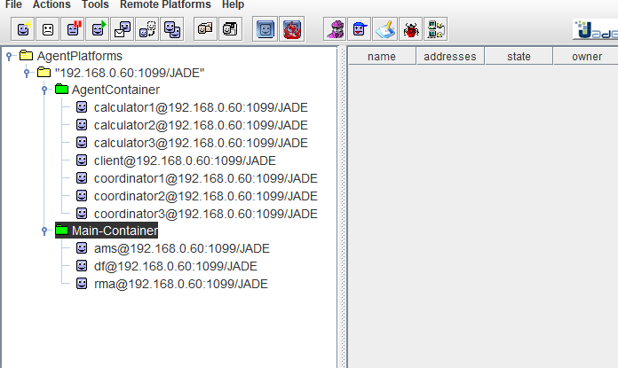
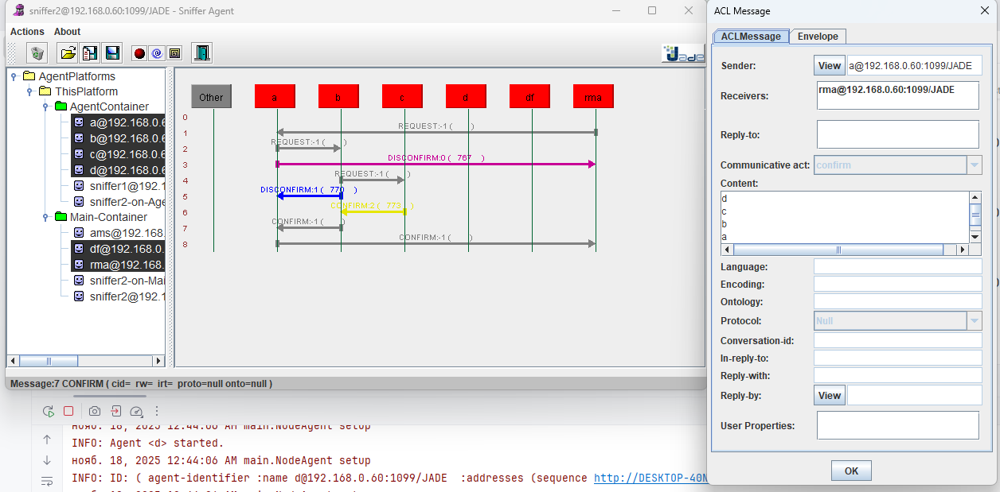
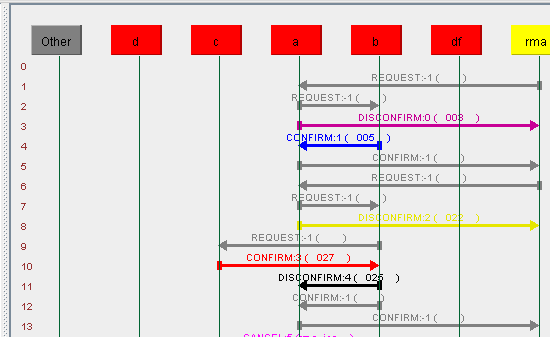

### Задача 1 (ветка main)


### Практика 3, задача 1б (ветка practice_03)

    1. Вместо передачи имён через аргумент, координатор получает имена вычислителей через DF.
    2. Координатор будет периодически обновлять список имён.

Координатор автоматически ищет агентов-вычислители через Directory Facilitator (DF).
Публикуем тип сервиса "calculator" для фильтрации (сервис нужен DF для взаимодействия с нашим сервисом вычислений).


```java
DFAgentDescription template = new DFAgentDescription();
ServiceDescription sdTemplate = new ServiceDescription();
sdTemplate.setType("calculator");
template.addServices(sdTemplate);
```


### Задача 2 (ветка practice_03_ex_2)

1) При получении REQUEST узел ищет целевую вершину у себя, в списке соседей, если нашел - отвечает отправителю,
   если нет - отсылает новое сообщение ВСЕМ соседям;
2) Если узел нашел у себя в соседях искомую вершину, он отправляет CONFIRM обратно по цепочке с накоплением контента в виде имен узлов.


### Задача 1в (ветка practice_04_ex_1_v)

### Условия и выполнение

1. **Логика координатора оформлена как машина из двух состояний**
    - Состояния: `ожидание запроса`, `выполнение вычисления`.
    - Реализовано через флаг `isProcessing`.
    - Во время выполнения новые запросы отклоняются с `REFUSE`.

2. **Логика вычислителя оформлена как машина из двух состояний**
    - Состояния: `свободен`, `занят`.
    - Реализовано через флаг `isBusy`.
    - Во время вычисления новые запросы отклоняются с `REFUSE`.

3. **Оба агента отвечают `REFUSE` при занятости**
    - Координатор: отклоняет, если `isProcessing == true`.
    - Вычислитель: отклоняет, если `isBusy == true`.
    - Отказ отправляется сразу, без задержки.

4. **Поведение продемонстрировано**
    - В логах видно:
        - Клиенты получают `REFUSE` и выводят:  
          `🚫 Запрос отклонён: Coordinator is busy`  
          `🚫 Запрос отклонён: Calculator is busy`


### Задача 1г (ветка practice_04_ex_1_g)

* Вычисления в отдельных потоках

Вывод из логов
```
calc1 начал вычисление в отдельном потоке...
calc2 начал вычисление в отдельном потоке...  
calc3 начал вычисление в отдельном потоке...
``` 
```java
private class CalculationTask implements Runnable {
    @Override
    public void run() {
        try {
            ...
            String[] parts = request.getContent().split(",");
            int start = Integer.parseInt(parts[0].trim());
            int end = Integer.parseInt(parts[1].trim());
            
            ...
            
            ACLMessage reply = request.createReply();
            reply.setPerformative(ACLMessage.CONFIRM);
            reply.setContent(String.valueOf(sum));
            send(reply);
            
        } catch (Exception e) {
            
        }
    }
}
```

* Работа с несколькими координаторами

Вывод из логов
```
INFO: Получен запрос от rma: "1,100"
INFO: Найдено вычислителей: 3

...

Задача отправлена: calc1: 1 → 34
Задача отправлена: calc2: 35 → 67
Задача отправлена: calc3: 68 → 100
...

INFO: Ожидание ответов от 3 вычислителей...
нояб. 05, 2025 2:33:46 PM main.CalculatorAgent$CalculationTask run
INFO: calc2 начал вычисление в отдельном потоке...
нояб. 05, 2025 2:33:46 PM main.CalculatorAgent$CalculationTask run
INFO: calc1 начал вычисление в отдельном потоке...
нояб. 05, 2025 2:33:46 PM main.CalculatorAgent$CalculationTask run
INFO: calc3 начал вычисление в отдельном потоке...
нояб. 05, 2025 2:33:51 PM main.CalculatorAgent$CalculationTask run
INFO: Ответ отправлен координатору coordinator1: 1683
нояб. 05, 2025 2:33:51 PM main.CalculatorAgent$CalculationTask run
INFO: Ответ отправлен координатору coordinator1: 595
нояб. 05, 2025 2:33:51 PM main.agents.coordinator.Coordinator$MainBehaviour handleReply
INFO: Получен ответ от calc2: 1683 (накоплено: 1683)
нояб. 05, 2025 2:33:51 PM main.agents.coordinator.Coordinator$MainBehaviour handleReply
INFO: Получен ответ от calc1: 595 (накоплено: 2278)
нояб. 05, 2025 2:33:51 PM main.CalculatorAgent$CalculationTask run
INFO: Ответ отправлен координатору coordinator1: 2772
нояб. 05, 2025 2:33:51 PM main.agents.coordinator.Coordinator$MainBehaviour handleReply
INFO: Получен ответ от calc3: 2772 (накоплено: 5050)
нояб. 05, 2025 2:33:51 PM main.agents.coordinator.Coordinator$MainBehaviour handleReply
INFO: Итог отправлен клиенту: 5050
```
Snapshot from Sniffer (выделенная область - взаимодействие 2 координаторов с 1 вычислителем)



### Задача 1д (ветка practice_05_ex_1_d)

Реализовать взаимодействие «заказчика» и «координаторов» через ContractNet.



После извещений координаторов, клиентом, о предложении, клиент выбирает лидера по **наименьшей** стоимости.
```
INFO: Received 3 proposals.
нояб. 17, 2025 11:54:20 PM main.agents.client.ContractNetInitiatorBehaviour handleAllResponses
INFO: Accepted proposal from coordinator3 (cost: 40)
```


"Победивший координатор" делит задачу между вычислителями.
```
INFO: Starting calculation for interval [1, 4]
нояб. 17, 2025 11:54:20 PM main.agents.calculator.SumCalculationBehaviour action
INFO: Starting calculation for interval [8, 10]
нояб. 17, 2025 11:54:20 PM main.agents.calculator.SumCalculationBehaviour action
INFO: Starting calculation for interval [5, 7]
```
Итог
````
INFO: Result collection completed. Total sum: 55
[client] Calculation completed: 55
````

### Задача 1е (ветка practice_06_ex_1_e)
Разделить главный контейнер и контейнер, из-под которого запускаются агенты.



### Задача 2b (ветка practice_06_ex_2_b)
Разделить главный контейнер и контейнер, из-под которого запускаются агенты.



### Задача 2v (ветка practice_06_ex_2_v)
Обеспечить работу алгоритма в циклическом графе.

```java
AgentController node1 = agentContainer.createNewAgent("a", NodeAgent.class.getName(), new Object[]{"b"});
AgentController node2 = agentContainer.createNewAgent("b", NodeAgent.class.getName(), new Object[]{"a", "c"});
AgentController node3 = agentContainer.createNewAgent("c", NodeAgent.class.getName(), new Object[]{"b", "d"});
AgentController node4 = agentContainer.createNewAgent("d", NodeAgent.class.getName(), new Object[]{"c", "a"});
```

